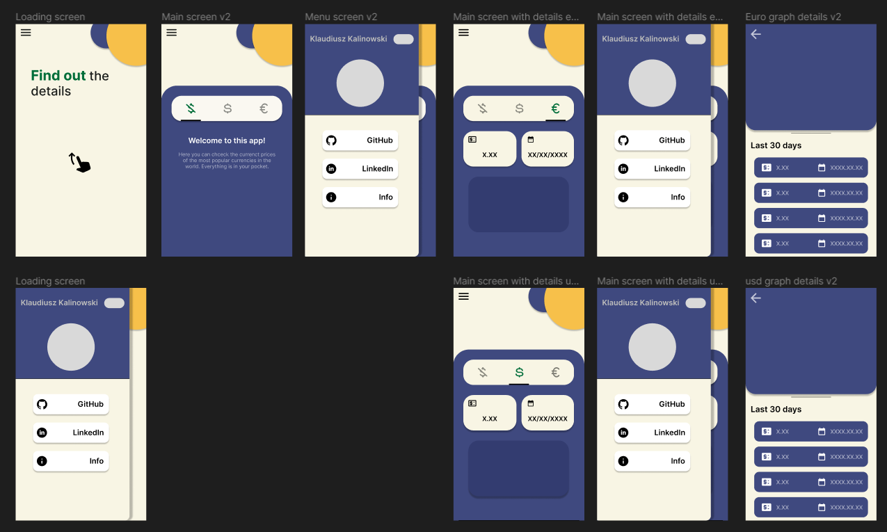

# Current Info

## Introduction
This app shows the latest info about currency for example the average price of the currency to PLN, the date of the current price, and the graph that shows the last 30 days of changing price. It is a really simple app but you can get a lot of knowledge from it.

---
## Roadmap

---
## Design
### 1. Lo-Fi
It is a low-fidelity design of how the app should look like. In designing such an app I focused on implementing things that would be intuitive to use and pretty. Despite its simple design app will be animated which will be shown in the Hi-Fi design.

### 2. Hi-Fi
When designing my hi-fi app, I wanted it to be aesthetically pleasing like my lo-fi design. To achieve this, I used Figma for its helpful features and to plan out the design process. This saved me a significant amount of time. Overall, using Figma taught me valuable lessons about designing mobile apps that I will apply in the future. Please note that the app image only shows the light mode, as I focused more on functionality than on color options for the dark mode.

---

> Here's a visualization of how the prototype is expected to operate. It's important to keep in mind that the actual project may not have animations and transitions that are identical to those shown in this demonstration. Nonetheless, this visual aid can give you a general idea of what the final product should look and function like.

## Programming
I learned so much from this project! One of the things I learned was how to maintain files to make them smaller, as well as many other functions that helped me build the project. The app is also responsive on different screens. I focused on using animations and transitions to make it more visually appealing. In the future, I know I'll be using the getx and provider packages because they made my work so much easier. I also made the application dual-themed so that the user can enjoy it no matter what time of day or night it is. Overall, working on this project was fun, and it encouraged me to make more apps in the future!

